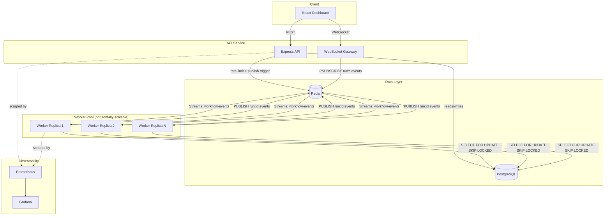
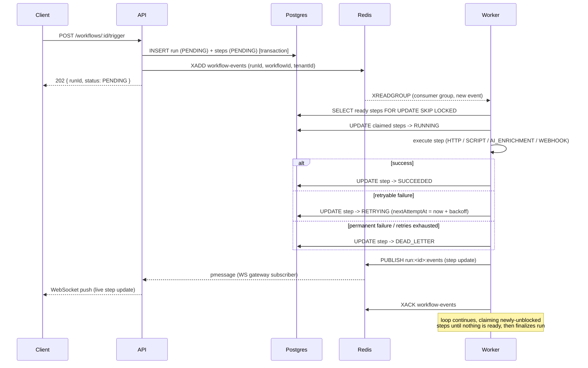
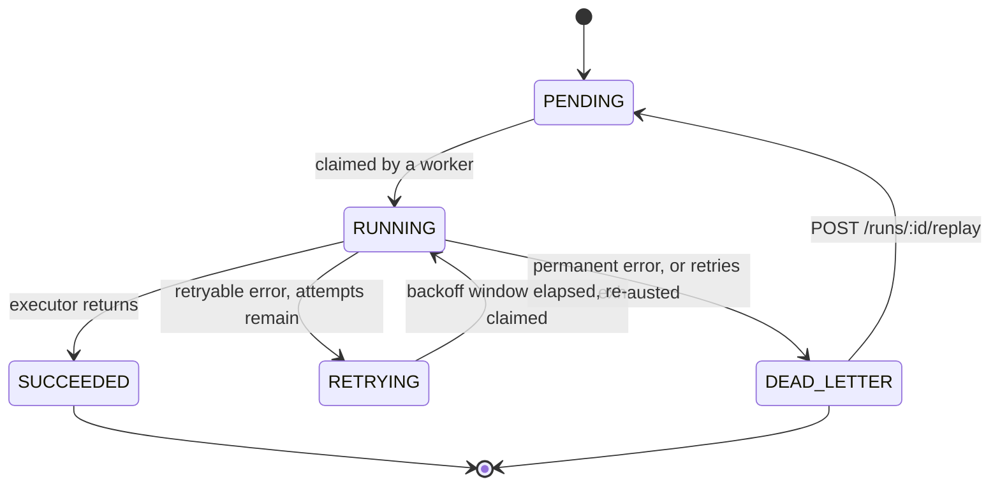
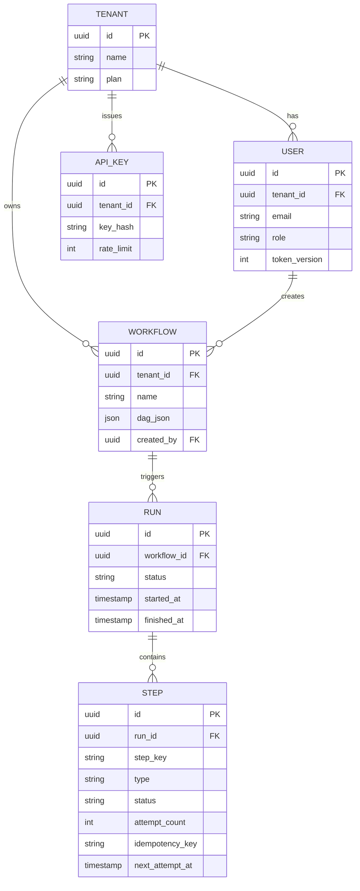

# PulseQueue Architecture

## High-level architecture

**Why two Redis primitives (Streams AND Pub/Sub) instead of one:**
Streams give durable, consumer-group, at-least-once delivery — required for
"a worker must execute this step exactly once, even if a worker crashes
mid-processing." Pub/Sub is fire-and-forget "tell whoever's listening right
now" — perfect for live dashboard updates, wrong for anything that must not
be lost. Using Streams for both would mean the dashboard misses updates
whenever nobody's connected (fine); using Pub/Sub for both would mean a
worker crash silently drops a step forever (not fine). One primitive per
delivery guarantee, not one primitive for everything.

## Trigger -> execution sequence

## Step state machine

## Entity-relationship diagram

## Why `SELECT ... FOR UPDATE SKIP LOCKED`

This is the most performance-critical query in the system. When
multiple worker replicas wake up for the same run simultaneously (a common
case: `docker compose up --scale worker=3`), they all query for the same set
of "ready" step keys. Without `SKIP LOCKED`, the second worker's `SELECT ...
FOR UPDATE` would **block** waiting for the first worker's row lock to
release — serializing workers for no reason, and in the worst case
deadlocking if lock order differs. With `SKIP LOCKED`, the second worker
simply skips whatever's already locked and claims whatever's left. Net
effect: N workers can claim N different ready steps from the same batch in
parallel, safely, with zero coordination beyond what Postgres already gives
you for free. No distributed lock service, no Redis-based mutex, no
application-level coordination logic required.

## Known limitations (said out loud, not hidden)

- **Prisma schema is duplicated** between `api/` and `worker/` rather than
  living in a shared package — a documented tradeoff for project scope, not
  an oversight. At real scale this would move to a shared `packages/db`.
- **Prometheus scraping the worker doesn't survive `--scale worker=N`
  cleanly** — Docker's internal DNS round-robins the `worker` hostname, so
  only one replica ever gets scraped. A real deployment would use
  Kubernetes-native service discovery (or Consul, or ECS service discovery)
  so every replica is discovered and scraped individually.
- **SCRIPT steps are a whitelisted transform registry, not arbitrary code
  execution** — a deliberate security boundary. Supporting genuinely
  arbitrary user code safely would need microVM sandboxing (Firecracker,
  gVisor) or a WASM runtime with no host syscall access, both well beyond
  this project's scope.
- **WebSocket auth token travels as a query parameter** — necessary because
  browsers can't set custom headers on the WS handshake. A production
  system might mint a short-lived, single-use "connection ticket" via a REST
  call just before connecting, so the long-lived access token itself never
  appears in a URL (which can end up in server access logs).
